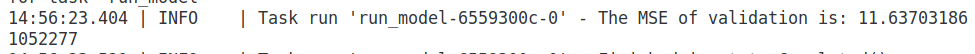
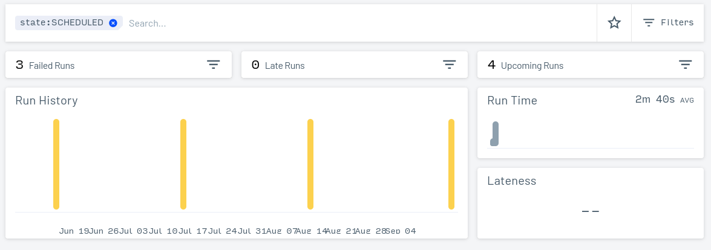
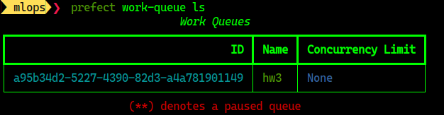

# MLZ Module 3

Code placed inside the `code` folder


# Q1

Ans: prepare_features

# Q2




Ans: 11.637

# Q3


Answer: 13,000 


# Q4

```
0 9 15 * *
```


# Q5




no. of runs: 4

Ans: 3 (closest option)


# Q6

(I have named the experiment 'random-forest-hyperopt1')



```
prefect work-queue ls
```

l
